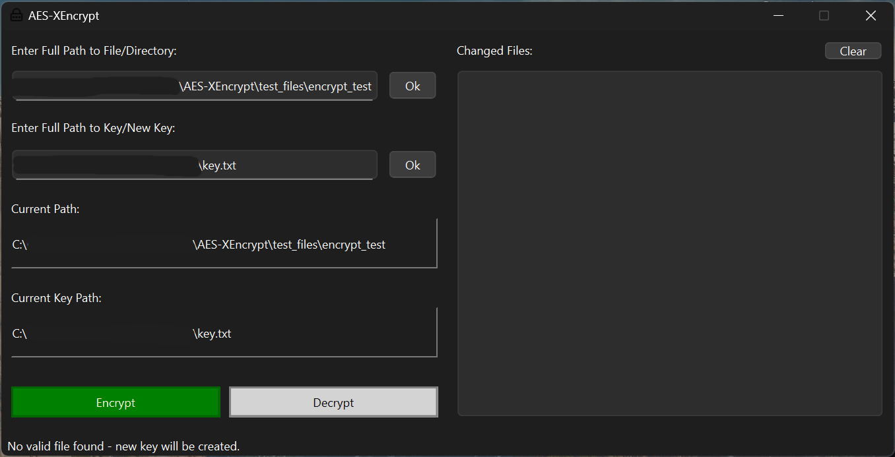
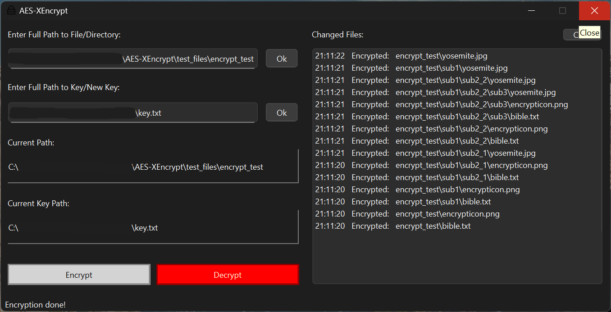

# AES-XEncrypt

**Recursive AES256 Encryption for File/Directory Structures**

---

## Overview

AES-256-XEncrypt is an tool that encrypts files and directory structures using the AES-256 algorithm.

---

  

  

## Features

- **AES-256:** Highest security possible.
- **Files and Recursive Directories:** Supports any type of file structure.
- **Multithreaded Performance:** Isolates and speeds up encryption process.
- **Cross-Platform:** Works on multiple operating systems (Qt framework)
- **User-Friendly UI**

## Credits

- **Encryption Library:** [OpenSSL](https://www.openssl.org) – Provides industry-standard AES-256 encryption algorithms.
- **OpenSSL Distribution:** [Shining Light Productions](https://slproweb.com/products/Win32OpenSSL.html) – Pre-compiled OpenSSL binaries for Windows development.

## Installation

1. Dowload the .zip release folder.
2. Run AES-XEncrypt.exe.
3. This application is unsigned, so a popup will show. On windows, it is titled "Windows protected your PC". Navigate to "More info" -> "Run anyway" to run the executable.
